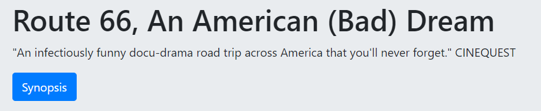

# Projet IMRTube

## Membres de l'équipe
Corentin BOSQUET
Quentin GALLIOU

*Tous les deux néophytes avec React)*

## Fonctionnalités de l'application

### Player
Player react qui permet de lire la vidéo.

#### Intéractions
Via le player, l'utilisateur peut mettre en pause, en lecture la vidéo. Il peut également gérer le son et passer en plein écran.

### Chapitrage
Liste de bouton qui permet de se rendre à des endroits particuliers dans la vidéo.
Si le chapitre est passé dans la vidéo, alors le bouton est "blanc" sinon, il est noir.

#### Intéraction
Si l'utilisateur clique sur un des boutons, il se rend dans la vidéo à ce chapitre.

### Carte
Liste les points d'intérêts de la vidéo.
Au fur et à mesure de la vidéo, les points vont s'afficher. Afin de mieux visualiser le trajet fait, des lignes reliront les marqueurs dans leur ordre d'apparition.

#### Intéractions
Si l'utilisateur clique une seule fois sur le marqueur, une popup s'affiche avec le nom du lieu.
S l'utilisateur double clique sur le marqueur, il se rend dans la vidéo à cette emplacement.

### Mots clés
Au fur et à mesure que la vidéo défile, une liste de mots clés va s'enrichir. Elle permet d'aller vers des pages wikipédia ou imdb.
Les fenêtres s'ouvriront dans un nouvel onglet.

### Chat
Un chat permet de discuter avec les autres personnes qui regarde la vidéo.